# Критерії приймання

- Створено репозиторій goit-js-hw-06.

- Домашня робота містить два посилання: на вихідні файли і робочу сторінку на
  GitHub Pages.

- Завдання виконані у точній відповідності до ТЗ (забороняється змінювати
  вихідний HTML завдання).

- В консолі відсутні помилки і попередження під час відкриття живої сторінки
  завдання.

- Імена змінних і функцій - зрозумілі та описові.

- Код відформатований за допомогою Prettier.

- Стартові файли Завантажуй стартові файли з готовою розміткою та підключеними
  файлами скриптів для кожного завдання.

- Скопіюй їх собі у проект.

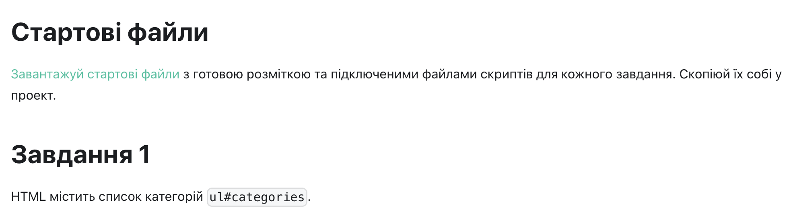

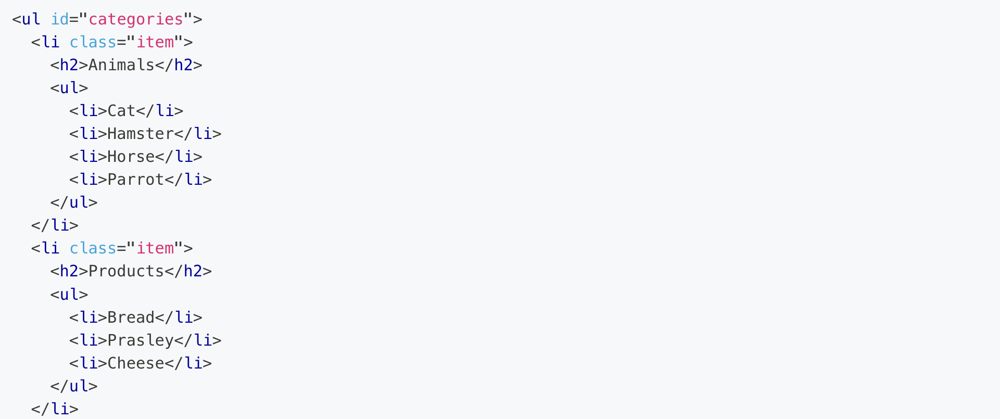
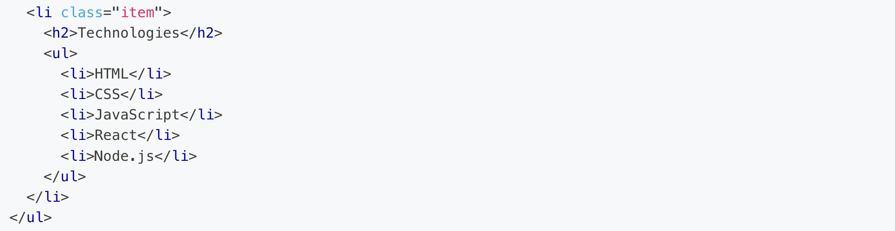

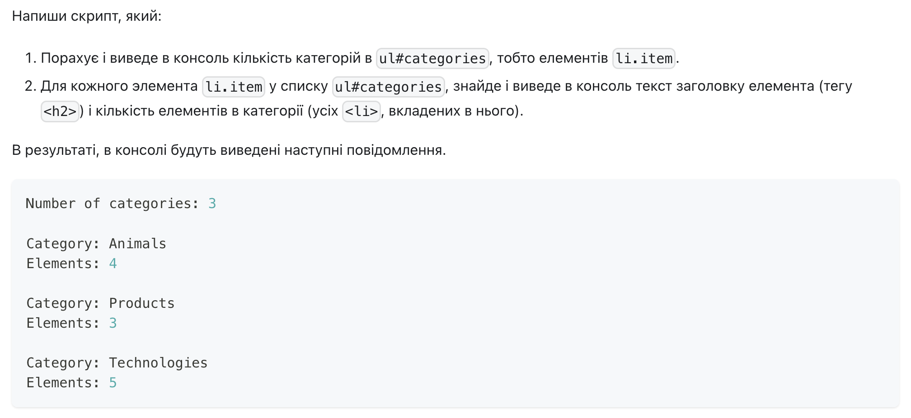
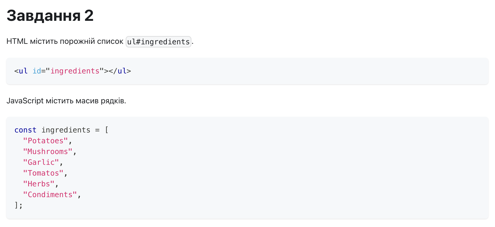
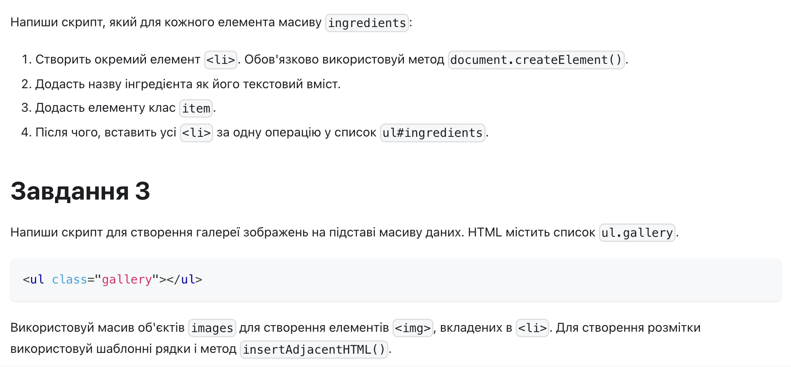
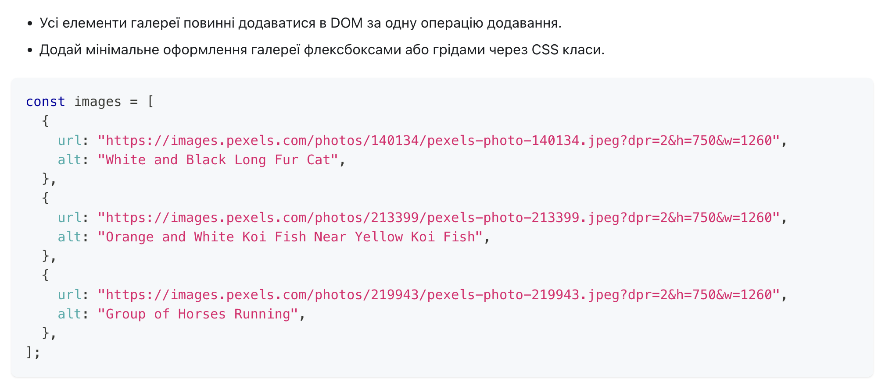

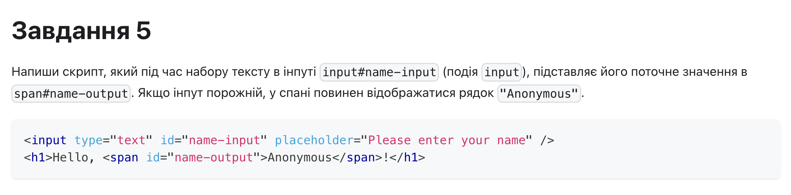
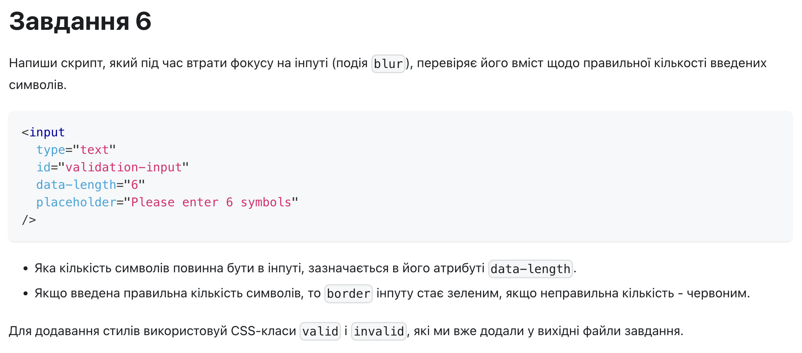
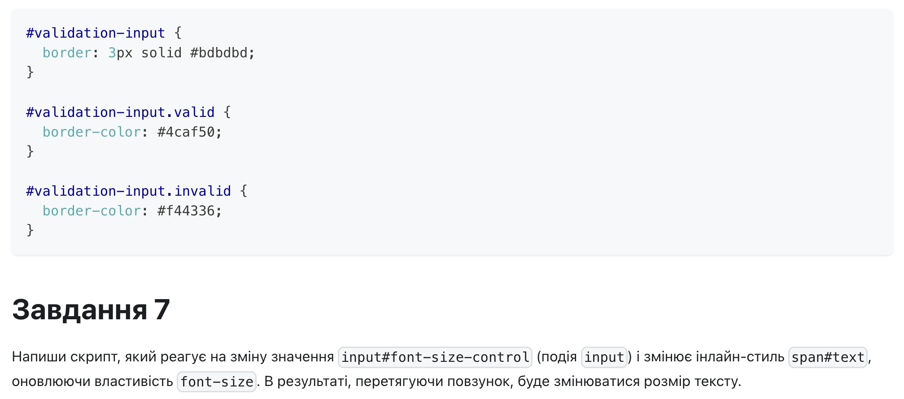
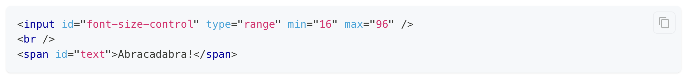
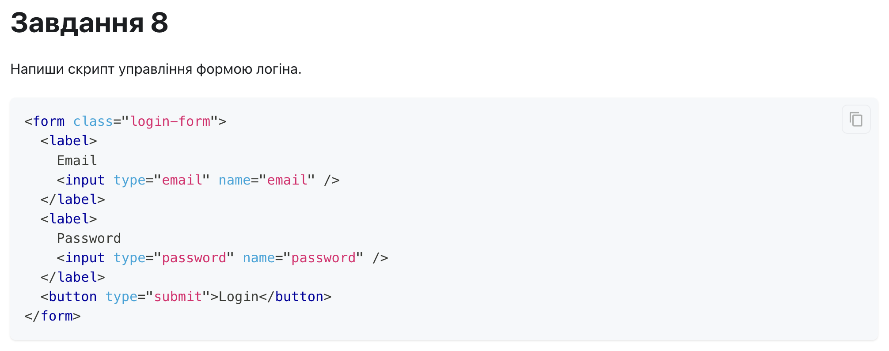
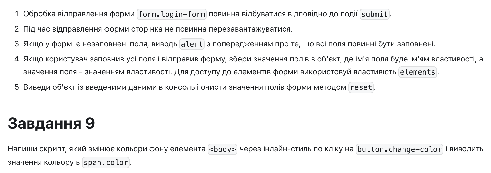
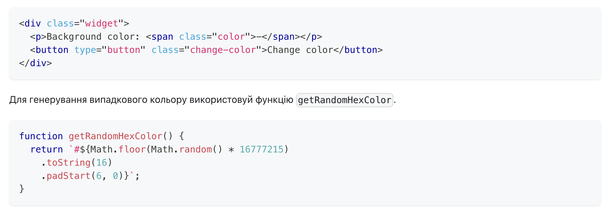
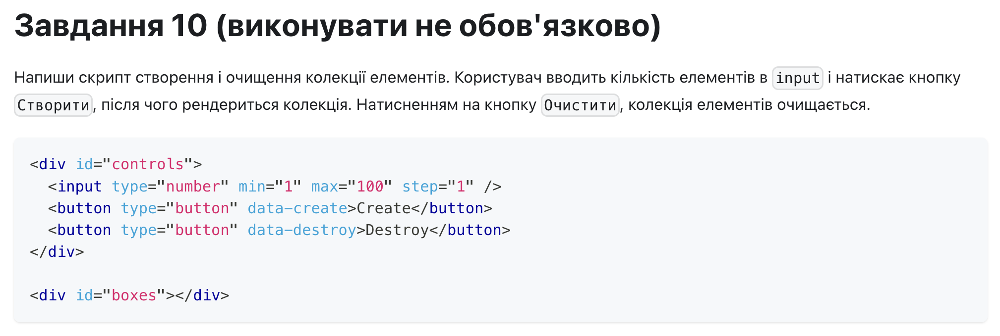
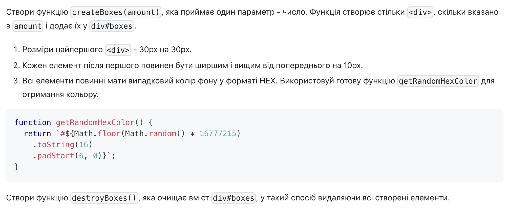
